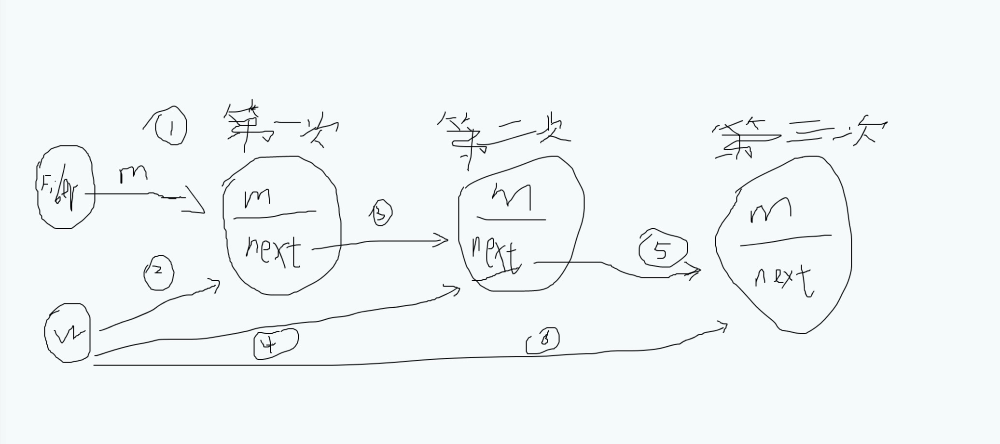

## useState的使用

```react
const App: React.FC = () => {
  const [count, setCount] = useState<number>(0)
  return (
      <>
          <p>You clicked {count} times</p>
          <button onClick={() => {
              setCount(count + 1)
          }}>
              Click me
          </button>
      </>
  )
}
```


## 思考

1. 为什么setXXX后不能马上拿到最新的state的值？

2. 多个setXXX是如何合并的？

3. setXXX到底是同步还是异步的？

4. 为什么setXXX的值相同时，函数组件不更新？

5. setXXX是什么时候初始化又是什么时候开始更新的？

6. hook，不要在循环、条件判断或者子函数中调用？


## 模拟useState的源码解析

```react
// useState 是通过2部分来实现的 
// 通过isMount 来区分这2部分 
// isMount 为true  代表初次进入
// isMount 为false 代表update

let isMount = true;

let workInprogressHook = null;

const App = () => {
    const [num, updateNum] = useState(0)
    console.log('num', num)
    return {
        onclick() {
            updateNum(num => num + 1)
            console.log('isUpdatedNum', num)
        }
    }
}

const fiber = {
  stateNode: App,
  memoizedState: null
}

const useState = (init) => {
  let hook;

  if (isMount) {
    // isMount 为true  准备缓存所有数据
    hook = {
        memoizedState: init,
        next: null,
        queun: {
            pending: null
        }
    }
    if (!fiber.memoizedState) {
        fiber.memoizedState = hook;
      } else {
        workInprogressHook.next = hook;
      }
      workInprogressHook = hook;

      // 数据存储在 fiber.memoizedState 这个链表上 如下面图1（详解链表过程）
  } else {
      // 进入了update阶段 当前的workInprogressHook 指向的fiber.memoizedState的链表 
      // hook 也指向了 iber.memoizedState的链表 的地址
      hook = workInprogressHook
      // workInprogressHook 获取下一个链路的数据
      workInprogressHook = workInprogressHook.next
  }

  // isMount true: 得到第一次init
  // isMount fasle: 拿到的是hook.memoizedState（指向的当前链表的memoizedState的值（不一定是是最新的值））
  // 如： 上一次更新了，拿到的是上一次更新前的值，没有更新拿到的就是最新的值
  let baseState = hook.memoizedState;

  // setState 当前函数不会更新值，会保存跟新的值在 queun.pending（fiber） 里面
  // 再次进入函数的时候，hook.queun.pending有值，代表上一次更新了这个值
  if (hook.queun.pending) {
      let firstUpdate = hook.queun.pending.next;

      do {
          const action = firstUpdate.action
          // 如果action 是一个函数,执行
          baseState = typeof action === 'function' ? action(baseState) : action

          firstUpdate = firstUpdate.next

          //firstUpdate !== hook.queun.pending.next  跳出循环
      } while (firstUpdate !== hook.queun.pending.next)

      hook.queun.pending = null;
  }

  // 这个时候baseState  是最新的值
  hook.memoizedState = baseState;

  return [baseState, dispatchAction.bind(null, hook.queun)]

}

const dispatchAction = (queun, action) => {
    const update = {
        action,
        next: null,
    }
    // 值形成一个环状
    if (queun.pending === null) {
        update.next = update
    } else {
        // 什么时候走else 更新的 使用setTimeOut(schedule(), 0)
        update.next = queun.pending.next
        queun.pending.next = update
    }

    // 值被保存在queun.pending  指向的是fiber 这个链路
    queun.pending = update
    // 再次render
    schedule();
}

// 1 触发更新
const schedule = () => {
    // fiber.memoizedState 和 workInprogressHook 指向同一个链表
    workInprogressHook = fiber.memoizedState
    const app = fiber.stateNode()
    isMount = false;
    return app
}

window.app = schedule();
// app.onclick()
```


### 图一


fiber 如何生成的链表

workInprogressHook ==> W

memoizedState ==> M

1, 2 表示第一次进入 isMount 为true的时候 fiber.workInprogressHook 和 workInprogressHook 指向同一个地址堆

第二个useState进入 workInprogressHook.next = hook; 就是图中标记的3的位置， workInprogressHook = hook;由2变成了4

第三个useState进入 workInprogressHook.next = hook; 就是图中标记的5的位置， workInprogressHook = hook;由4变成了6

以此循环





## 思考解答

#### 1. 为什么setXXX后不能马上拿到最新的state的值？

根本原因是setState并不是真正意义上的异步操作，它只是模拟了异步的行为。React中会去维护一个标识（isBatchingUpdates），判断是直接更新还是先暂存state进队列。

只在合成事件和钩子函数中是“异步”的，在原生事件和 setTimeout, promise 中都是同步的

#### 2. 多个setXXX是如何合并的？

这里就涉及到 react 的 batchUpdate 机制，合并更新

如果没有合并更新，在每次执行 useState 的时候，组件都要重新 render 一次，会造成无效渲染，浪费时间（因为最后一次渲染会覆盖掉前面所有的渲染效果）。所以 react 会把一些可以一起更新的 useState/setState 放在一起，进行合并更新。

#### 3. setXXX到底是同步还是异步的？

其实问题1和2了解了的话，3就很好了解了，因为react batchUpdate 机制，造成的所谓的异步

补充一点哪些能明中 batchUpdate机制： 生命周期，react的注册事件。 不能命中的事件：setTimeout/setInterval/Promise.then(fn)/fetch 回调/xhr 网络回调

#### 4. 为什么setXXX的值相同时，函数组件不更新？

是进行判断上一次的值和当前的值是否一样

#### 5. setXXX是什么时候初始化又是什么时候开始更新的？

如上面的模拟useState源码， isMount 为true的时候代表初始化， 为false的时候代表更新

#### 6. hook，不要在循环、条件判断或者子函数中调用？

保存的数据是一个链式，如果是一个判断语句，第一次是true,但是后面变成了false,后面数据取到的值 取到的是上一个的值


1,2,3,4  [可参考setState](./setState)


## React‘灵异’现象

#### 1. useState更新相同的State,函数组件为什么执行2次

对于更新组件的方法函数组件 useState 和类组件的setState有一定区别，useState源码中如果遇到两次相同的state，会默认阻止组件再更新，但是类组件中setState如果没有设置 PureComponent，两次相同的state 也会更新

双缓冲树：React 用 workInProgress树(内存中构建的树) 和 current(渲染树) 来实现更新逻辑。我们console.log打印的fiber都是在内存中即将 workInProgress的fiber树。双缓存一个在内存中构建，在下一次渲染的时候，直接用缓存树做为下一次渲染树，上一次的渲染树又作为缓存树，这样可以防止只用一颗树更新状态的丢失的情况，又加快了dom节点的替换与更新

更新机制：在一次更新中，首先会获取current树的 alternate作为当前的 workInProgress，渲染完毕后，workInProgress 树变为 current 树。我们用如上的树A和树B和已经保存的baseState模型，来更形象的解释了更新机制