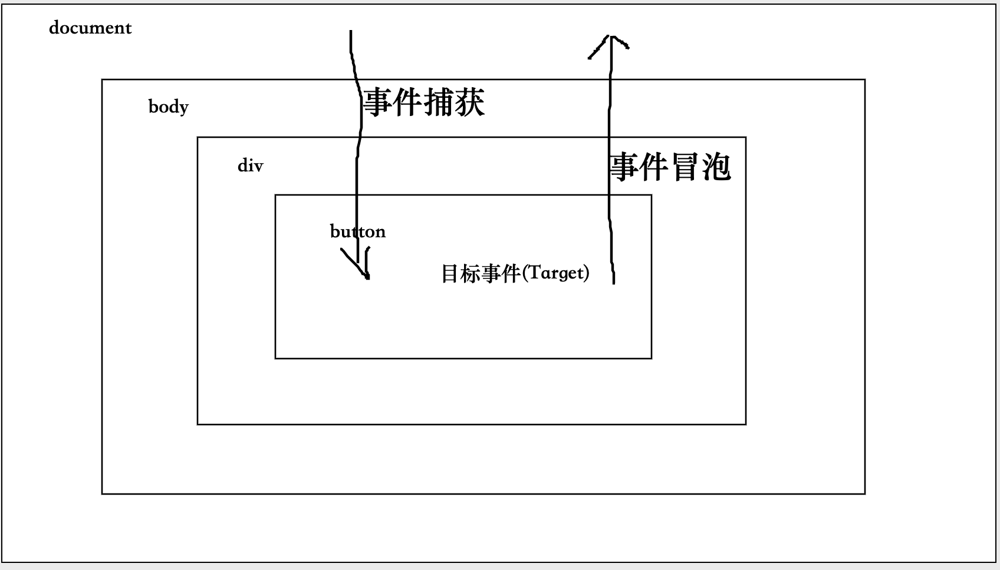

# 合成事件

### 1.事件工作流

- 事件捕获
- 事件目标
- 事件冒泡
- 事件委托
- 先绑定先执行





### 2.事件差异


| 类型         | 原声事件     | 合成事件         |
| ------------ | ------------ | ---------------- |
| 命名方式     | 全是小写     | 小驼峰命名       |
| 事件处理函数 | 字符串       | 函数对象         |
| 阻止默认行为 | return false | e.preventDefault |


```js
// 原声事件
<a href="#" onclick="handleClick()" />
 
// 合成事件
<a href="#"  onClick={handleClick} />
  
```


### 3.合成事件

​		react 17 之前 绑定在document上面

​		react 17之后 绑定在容器上面


#### （17之后）react 点击


```react
import * as React from "react"

import { useRef, useEffect } from "react"

const SyntheticEvent = () => {
  const parentRef = useRef(null)
  const childrenRef = useRef(null)

  useEffect(() => {
    parentRef.current.addEventListener("click", () => {
      console.log("原生冒泡parent")
    })
    parentRef.current.addEventListener(
      "click",
      () => {
        console.log("原生捕获parent")
      },
      true
    )

    childrenRef.current.addEventListener("click", () => {
      console.log("原生冒泡child")
    })
    childrenRef.current.addEventListener(
      "click",
      () => {
        console.log("原生捕获child")
      },
      true
    )

    document.addEventListener("click", () => {
      console.log("ducoment 原生事件捕获点击")
    })

    document.addEventListener(
      "click",
      () => {
        console.log("ducoment 原生事件冒泡点击")
      },
      true
    )
  }, [])
  const handleChildClick = () => {
    console.log("React冒泡child")
  }

  const handleChildCaptureClick = () => {
    console.log("React捕获child")
  }

  const handleParentClick = () => {
    console.log("React冒泡parent")
  }

  const handleParentCaptureClick = () => {
    console.log("React捕获parent")
  }

  return (
    <div
      ref={parentRef}
      onClick={handleParentClick}
      onClickCapture={handleParentCaptureClick}
    >
      <p
        ref={childrenRef}
        onClick={handleChildClick}
        onClickCapture={handleChildCaptureClick}
      >
        合成事件点击
      </p>
    </div>
  )
}

export default SyntheticEvent


// 打印的顺序
ducoment 原生事件冒泡点击
React捕获parent
React捕获child
原生捕获parent
原生捕获child
原生冒泡child
原生冒泡parent
React冒泡child
React冒泡parent
ducoment 原生事件捕获点击
```


#### js实现react 合成事件

##### 	react 17之前 绑定在document上面

```js
  <body>
  <div id="app">
    <div id="parent">
      <p id="child">合成事件</p>
    </div>
  </div>
  <script>
    function dispatcher(event) {
      let paths = []
      let current = event.target
      while(current) {
        paths.push(current)
        current = current?.parentNode
      }

      // push 完的数组 [child, parent, body]

      for(let i = paths.length - 1; i >= 0; i--) {
        let handler = paths[i].onClickCapture
        handler && handler()
      }

      for(let i = 0; i < paths.length; i++) {
        let handler = paths[i].onClick
        handler && handler()
      }

    }
    // 注册react 的 事件委托
    document.addEventListener('click', dispatcher)


    const parent = document.getElementById('parent')
    const child = document.getElementById('child')

    parent.addEventListener("click", () => {
      console.log("原生冒泡parent")
    })
    parent.addEventListener(
      "click",
      () => {
        console.log("原生捕获parent")
      },
      true
    )

    child.addEventListener("click", () => {
      console.log("原生冒泡child")
    })
    child.addEventListener(
      "click",
      () => {
        console.log("原生捕获child")
      },
      true
    )

    document.addEventListener("click", () => {
      console.log("ducoment 原生事件捕获点击")
    })

    document.addEventListener(
      "click",
      () => {
        console.log("ducoment 原生事件冒泡点击")
      },
      true
    )


    parent.onClick = () => {
      console.log("React冒泡parent")
    }

    parent.onClickCapture = () => {
      console.log("React捕获parent")
    }

    child.onClick = () => {
      console.log("React冒泡child")
    }

    child.onClickCapture = () => {
      console.log("React捕获child")
    }

  </script>
</body>

// 17 之前打印的顺序
ducoment 原生事件冒泡点击
原生捕获parent
原生捕获child
原生冒泡child
原生冒泡parent
React捕获parent
React捕获child
React冒泡child
React冒泡parent
ducoment 原生事件捕获点击

```


##### react 17之后 绑定在容器上面


```js
<body>
  <div id="app">
    <div id="parent">
      <p id="child">合成事件</p>
    </div>
  </div>
  <script>
    function dispatcher(event, capture) {
      let paths = []
      let current = event.target
      while(current) {
        paths.push(current)
        current = current?.parentNode
      }

      if (capture) {
        for(let i = paths.length - 1; i >= 0; i--) {
          let handler = paths[i].onClickCapture
          handler && handler()
        }
      } else {
        for(let i = 0; i < paths.length; i++) {
          let handler = paths[i].onClick
          handler && handler()
        }
      }
    }
    // 注册react 的 事件委托
    document.addEventListener('click', dispatcher)


    const parent = document.getElementById('parent')
    const child = document.getElementById('child')

    const App = document.getElementById('app')
    App.addEventListener("click", (e) => dispatcher(e, true), true)
    App.addEventListener("click", (e) => dispatcher(e, false))

    parent.addEventListener("click", () => {
      console.log("原生冒泡parent")
    })
    parent.addEventListener(
      "click",
      () => {
        console.log("原生捕获parent")
      },
      true
    )

    child.addEventListener("click", () => {
      console.log("原生冒泡child")
    })
    child.addEventListener(
      "click",
      () => {
        console.log("原生捕获child")
      },
      true
    )

    document.addEventListener("click", () => {
      console.log("ducoment 原生事件捕获点击")
    })

    document.addEventListener(
      "click",
      () => {
        console.log("ducoment 原生事件冒泡点击")
      },
      true
    )


    parent.onClick = () => {
      console.log("React冒泡parent")
    }

    parent.onClickCapture = () => {
      console.log("React捕获parent")
    }

    child.onClick = () => {
      console.log("React冒泡child")
    }

    child.onClickCapture = () => {
      console.log("React捕获child")
    }

  </script>
</body>

// 17 之后打印的顺序
ducoment 原生事件冒泡点击
React捕获parent
React捕获child
原生捕获parent
原生捕获child
原生冒泡child
原生冒泡parent
React冒泡child
React冒泡parent
React冒泡child
React冒泡parent
ducoment 原生事件捕获点击
```


### 4.事件系统更改

- 更改了事件委托
- 去除事件池


